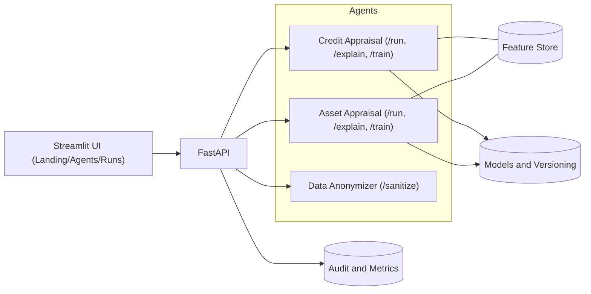

# 🏦 Banking Agent Liberty

> **AI agents for regulated banking workflows — fast • explainable • production‑ready.**

<p align="center">
  
</p>

<p align="center">
  <a href="#"></a>
  <a href="#"></a>
  <a href="#"></a>
  <a href="#"></a>
  <a href="#"></a>
</p>

---

## 🔎 Table of Contents

* [What](#-what) • [So What](#-so-what) • [For Who](#-for-who) • [Where](#-where) • [What Now](#-what-now)
* [Key Features](#-key-features) • [KPIs](#-kpis) • [Architecture](#-architecture) • [Screenshots](#-screenshots)
* [Quickstart](#-quickstart) • [Docker](#-docker) • [Configuration](#-configuration)
* [Security & Compliance](#-security--compliance) • [Roadmap](#-roadmap) • [Contributing](#-contributing) • [License](#-license)

---

## ❓ What

**Banking Agent Liberty** is a modular **AI agent library** for retail‑bank workflows. It ships with plug‑and‑play agents—**Credit Appraisal**, **Asset Appraisal**, **Data Anonymization**, KYC/AML helpers—plus a shared **Streamlit UI** and **FastAPI** layer. Deploy on on‑prem **OpenStack** or cloud GPUs with identical configs.

**Agent Contract:** `POST /run` • `GET /explain` • `POST /train` • `GET /health`.

---

## 💡 So What

* **Speed:** Synthetic seeding, one‑click anonymization, batch runs, cached explainability → **days ➜ minutes**.
* **Quality:** Feature store hygiene, SHAP‑style explanations, policy guards reduce bias & drift.
* **Compliance:** Data localization defaults, immutable logs, human‑in‑the‑loop audit trails.
* **Extensibility:** Swap models (HF/LightGBM/scikit‑learn) and vector DBs without UI changes.

**Outcome:** faster approvals, lower risk, clearer audits.

---

## 👥 For Who

* **Banks & Fintechs** needing faster, auditable credit/collateral flows.
* **AI/Data Teams** wanting reproducible, explainable agents with clean APIs.
* **Solution Architects** targeting hybrid OpenStack ↔ Cloud.
* **Ops & Risk** requiring clear logs, approvals, and rollback paths.

---

## 📍 Where

* **Runs Anywhere:** laptop, on‑prem OpenStack, or cloud GPUs.
* **Data Sovereignty:** anonymize at the edge before training/inference.

---

## 🚀 What Now

1. **Clone & configure** (SSH)
2. **Launch Agent Hub UI** (try credit/asset flows)
3. **Connect data:** CSV/parquet or synthetic generator
4. **Enable policies + SSO**
5. **Measure KPIs** & iterate

> ⏩ Jump to [Quickstart](#-quickstart).

---

## ✨ Key Features

* **Credit Appraisal Agent** — decisions + SHAP explanations, scorecards, policy checks.
* **Asset Appraisal Agent** — market comps, inspector intake, geo‑tag heatmaps, uncertainty bands.
* **Data Anonymizer** — PII masking/tokenization; reversible under custody keys.
* **Feedback → Retrain** — capture human outcomes, re‑train safely, version models.
* **Observability** — run IDs, artifacts, audit logs, exportable reports.
* **Modular Backends** — Hugging Face, scikit‑learn/LightGBM, pluggable vector DBs (FAISS/pgvector/Qdrant).

---

## 📊 KPIs

| Domain     | KPI                              | Why it matters               | How Liberty helps                                     |
| ---------- | -------------------------------- | ---------------------------- | ----------------------------------------------------- |
| Credit     | **TAT (Time‑to‑Approve)**        | Faster decisions ➜ better CX | Synthetic seeding, batch scoring, cached explanations |
| Credit     | **Approval Quality / Default Δ** | Reduce risk                  | Feature hygiene, policy guards, bias checks           |
| Asset      | **Valuation Variance**           | Pricing confidence           | Market comps + uncertainty bands                      |
| Asset      | **Inspector SLA**                | Field ops efficiency         | Mobile/CSV intake, geotag reminders                   |
| Ops        | **Model Drift / Fairness**       | Reliability & fairness       | Drift alerts, re‑train loop                           |
| Compliance | **Audit Completeness**           | Regulator trust              | Run IDs, artifacts, reproducible reports              |

---

## 🏗️ Architecture



**Tenets:** HTTP/JSON contracts • Deterministic run IDs • Replaceable models/backends • Edge anonymization by default.

---

## 🖼️ Screenshots

> Replace placeholders under `docs/` with your real captures.

* **Agent Hub UI:** `docs/ui-overview.png`
* **Credit Appraisal:** `docs/ui-credit.png`
* **Asset Appraisal (map):** `docs/ui-asset-map.png`
* **Audit & Explainability:** `docs/ui-explain.png`

```html
<p align="center">
  
</p>
```

---

## ⚡ Quickstart

> Requirements: Python 3.10+, Git; optional: Docker, GPU drivers.

```bash
# 1) Clone (SSH)
git clone git@github.com:Sherlock2019/banking-agent-liberty.git
cd banking-agent-liberty

# 2) Create venv & install
python3 -m venv .venv
source .venv/bin/activate
pip install -U pip
pip install -r services/ui/requirements.txt
pip install -r services/api/requirements.txt

# 3) Run UI & API (two terminals)
# Terminal A (UI)
cd services/ui
streamlit run app.py

# Terminal B (API)
cd services/api
uvicorn main:app --reload --port 8000

# 4) Open the Hub
# http://localhost:8501
```

---

## 🐳 Docker

```bash
docker compose up -d --build
# Logs
docker compose logs -f ui api
```

---

## 🛠️ Configuration

```
.env
├─ AGENT__CREDIT__MODEL_DIR=agents/credit_appraisal/models/trained
├─ AGENT__ASSET__MODEL_DIR=agents/asset_appraisal/models/trained
├─ DATA__RUNS_DIR=services/ui/.runs
├─ SECURITY__ANON_KEYRING=.keys/anon
├─ GPU__PROFILE=auto   # cpu|cuda|mps|auto
```

* Put trained models under `agents/<agent>/models/trained/`
* Or start with **synthetic → anonymize → train** directly in the UI
* Vector DB backends are pluggable (FAISS/pgvector/Qdrant)

---

## 🔐 Security & Compliance

* **Data Sovereignty by Default:** anonymize/pseudonymize at the edge.
* **Immutable Audit Trails:** run IDs, model/version lineage, signed artifacts.
* **Least‑Privilege Keys & Secrets:** scoped tokens; rotate regularly.
* **Human‑in‑the‑Loop Controls:** approvals and overrides are logged and exportable.

---

## 🧭 Roadmap

* [ ] Agent marketplace cards + per‑agent KPIs
* [ ] GPU profile selector & benchmarks
* [ ] Fairness & drift dashboards
* [ ] Pluggable vector DB (FAISS/pgvector/Qdrant)
* [ ] Multi‑tenant RBAC & SSO
* [ ] Mobile inspector intake app (offline‑first)

---

## 🤝 Contributing

* Open an issue with context (use case, data shape, compliance needs)
* Follow conventional commits
* Run tests before pushing

```bash
pytest -q
```

---

## 📄 License

MIT — see `LICENSE`.

---

### 📝 Notes

* Images in `docs/` are placeholders — replace with your branding.
* For regulated deployments, enable anonymization by default and review data residency.
